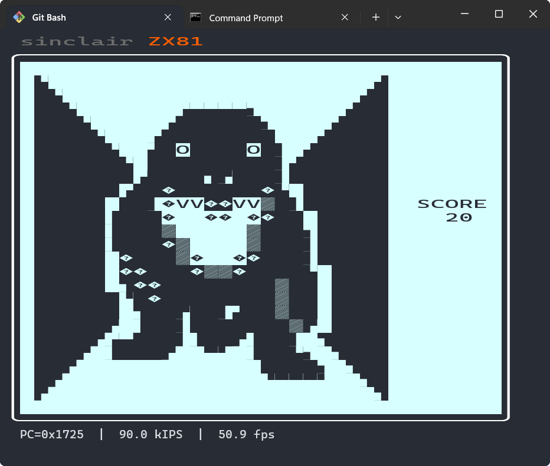

# `play-eightbit`

An emulator for the Zilog Z80 8-bit CPU, to allow machine emulation of the Sinclair ZX81.

### Limitations of the Z80 CPU emulation

- Interrupt-related instructions (`DI`, `EI`, `IM` and the `IFF1`, `IFF2` flags) and support for interrupts
  are not currently implemented.
- I/O instructions (`IN`, `IND`, `INDR`, `INI`, `INIR` and `OUT`, `OUTD`, `OTDR`, `OUTI`, `OTIR`) are not correctly
  implemented yet (particularly how they affect the condition bits / flags).
- Instruction timing, T-states, machine-cycles are not currently implemented. Each instruction runs as fast as the JVM
  can execute it, which is completely unrelated to the timing on a real Z80.
- Although, ironically, most undocumented instructions had to be implemented to get the `zexdoc` tests to pass,
  the condition bits 3 and 5 (also know as flags X and Y) are not currently implemented.
- The `zexdoc` tests don't test interrupt or I/O instructions, so there could be unexpected issues in these areas.

### Limitations of the ZX81 machine emulation

- There can be issues with the keyboard. This affects games which don't scan the keyboard themselves nor wait for input
  using the standard routines (but rely solely on the interrupt-based screen display to update the system variables).
- There is `LOAD` but no `SAVE` (and `LOAD` requires the filename to be specified - it should be a classpath resource
  named like `/z80/zx81/mygame.p` to be loadable as `LOAD "MYGAME"` in the emulator).
- There is no `SLOW` or `FAST` mode. The machine likely thinks it is a ZX81 ROM running on ZX80 hardware because it
  will not see the NMI generator when it looks for it, but the display is updated about 50 times per second by "ghost
  hardware" that runs outside of the machine emulation.
- Timing is achieved using a `Thread.sleep(1)` every few hundred instruction steps, to emulate about 95 instructions
  per millisecond (yep, that's how slow a `SLOW` mode ZX81 would be). It should be done using T-states and cycles
  rather than instructions - but in practice, it seems OK.
- The display is terminal-based, so there's no way high-resolution graphics can work on it (even if it wasn't, ZX81
  HRG or pseudo-HRG requires cycle-level timing to work, which the underlying Z80 emulation does not have).
- The Unicode "Symbols for Legacy Computing" block (added in Unicode 16.0) is not well-supported by fonts, so you'll
  notice that the half-grey graphic symbols may appear as question marks in a diamond in the following screenshot.
- I've only provided an implementation of the `TerminalSupport` interface for Windows, but it should be straightforward
  to add Linux or macOS implementations. Also, I've not worried about supporting old versions of Windows: you'll need
  a version of Windows (likely a recent build of Windows 10 or Windows 11) that supports UTF-8 console, and virtual
  terminal processing (including ANSI escapes for 256-color terminals, and ANSI virtual terminal input for cursor keys,
  etc.).

### Screenshot

